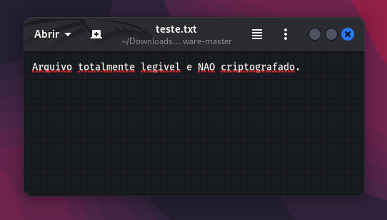
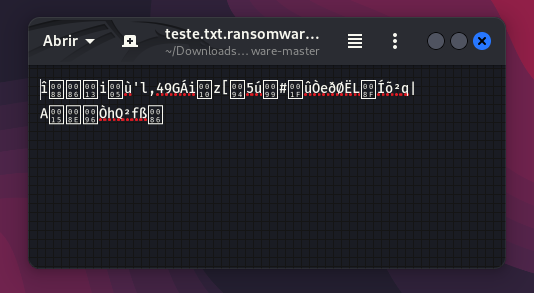

# Desafio Ransomware da DIO e Santander

Nesse desafio usaremos basicamente dois arquivos:
- encrypter.py --> Código para criptografar os arquivos.
- decrypter.py --> Código para descriptografar os arquivos.

## Requisitos

- Python
- Módulo pyaes

## Instalação do módulo pyaes

Para instalar o módulo pyaes, abra um terminal e execute o seguinte comando:

`pip install pyaes`

## Criptografia de arquivos

Para criptografar um arquivo, execute o seguinte comando:

`python encrypter.py`

## Descriptografia de arquivos

Para descriptografar um arquivo, execute o seguinte comando:

`python decrypter.py`

## Imagens

Arquivo descriptografado:

Arquivo criptografado:

